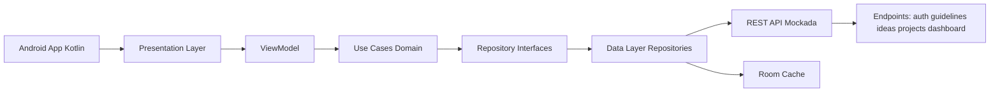
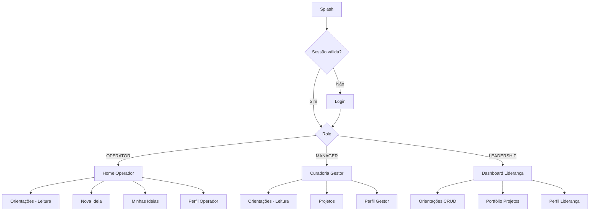
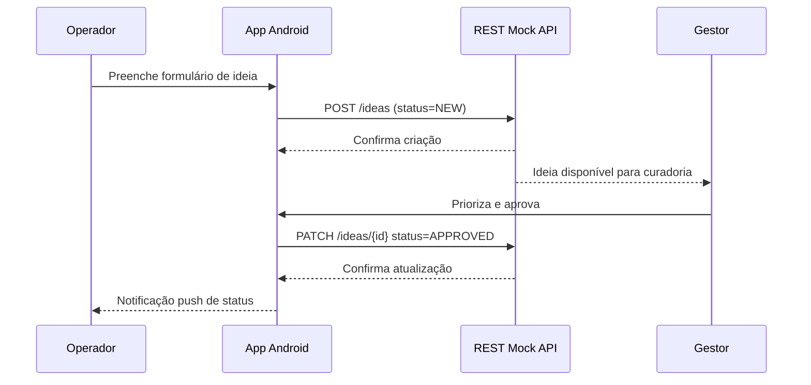

# SPEC: Challenge Águia Branca - App Mobile Android Nativo

## Sumário
1. [Visão Geral](#visão-geral)  
2. [Escopo Funcional por Perfil](#escopo-funcional-por-perfil)  
3. [Arquitetura Técnica (MVVM + Clean Architecture)](#arquitetura-técnica-mvvm--clean-architecture)  
4. [Integração Externa Escolhida (APIs REST Mockadas)](#integração-externa-escolhida-apis-rest-mockadas)  
5. [Permissões e Autorização por Perfil](#permissões-e-autorização-por-perfil)  
6. [Especificação de Funcionalidades e Critérios de Aceite](#especificação-de-funcionalidades-e-critérios-de-aceite)  
7. [Modelo de Dados (Contrato REST Mockado)](#modelo-de-dados-contrato-rest-mockado)  
8. [Regras de Segurança (MVP com API Mock)](#regras-de-segurança-mvp-com-api-mock)  
9. [Fluxos de Navegação](#fluxos-de-navegação)  
10. [Diretrizes de UI/UX](#diretrizes-de-uiux)  
11. [Requisitos Não Funcionais](#requisitos-não-funcionais)  
12. [Observabilidade](#observabilidade)  
13. [Plano de Testes](#plano-de-testes)  
14. [Roadmap (Apenas Sprint 1)](#roadmap-apenas-sprint-1)  
15. [Checklist de Entrega](#checklist-de-entrega)  
16. [Roteiro do Vídeo Demonstrativo (5 min)](#roteiro-do-vídeo-demonstrativo-5-min)

---

## Visão Geral
O projeto consiste em um aplicativo Android nativo, desenvolvido em Kotlin, para gestão da inovação corporativa do Grupo Águia Branca, cobrindo o funil capturar → estruturar → acompanhar. O app conecta estratégia, pessoas, processos e tecnologia por meio de cinco módulos principais: autenticação, orientações estratégicas, ideias, projetos e dashboard executivo. Para entrega rápida de faculdade, a conectividade externa escolhida será apenas consumo de APIs REST mockadas, sem Firebase.

Decisão explícita de escopo (para avaliação):
- Este projeto NAO usa Firebase.
- Este projeto atende ao requisito de conectividade externa por meio de consumo HTTP real de API REST mockada.
- A API mockada sera hospedada em serviço externo (exemplo: MockAPI), com endpoints públicos para GET, POST e PUT/PATCH.

Objetivos de negócio:
- Aumentar o engajamento de colaboradores na captura de ideias.
- Reduzir o tempo entre registro de ideia e avaliação.
- Transformar ideias aprovadas em projetos acompanháveis.
- Dar visibilidade de ROI, produtividade, custo, lucro e investimento para liderança.

---

## Escopo Funcional por Perfil

| Perfil | Permissões principais |
|---|---|
| Operador | Login, consultar orientações, cadastrar ideias, visualizar próprias ideias e status |
| Gestor | Login, consultar orientações, consultar todas as ideias, priorizar ideias, aprovar ideias, criar/editar projetos, registrar progresso e resultados |
| Liderança | Login, CRUD de orientações estratégicas, consultar portfólio de projetos, visualizar dashboard consolidado |

---

## Arquitetura Técnica (MVVM + Clean Architecture)

### Stack
- Linguagem: Kotlin
- UI: Jetpack Compose
- Arquitetura: MVVM + Clean Architecture
- Injeção de dependência: Hilt
- Concorrência: Coroutines + Flow
- Persistência local: Room (cache offline essencial)
- Rede: Retrofit + OkHttp + Kotlinx Serialization (ou Moshi)
- Backend para Sprint 1: API REST mockada (MockAPI ou equivalente)
- Build: Gradle Kotlin DSL
- Testes: JUnit5, MockK, Turbine, Espresso/Compose Test

### Camadas
- Presentation: telas Compose, ViewModels, estados de UI, eventos de UI.
- Domain: entidades, casos de uso, regras de negócio, contratos de repositório.
- Data: implementações de repositório, data sources REST/local, mapeadores DTO ↔ entidade.

### Diagrama de Arquitetura

### Convenções de pacote (proposta)
- app
- core
- feature/auth
- feature/guidelines
- feature/ideas
- feature/projects
- feature/dashboard
- data/remote/rest
- data/local/room
- domain/model
- domain/usecase

---

## Integração Externa Escolhida (APIs REST Mockadas)

Decisão para entrega rápida:
- Implementar somente 1 opção de conectividade externa: Consumo de APIs REST mockadas.
- Escopo mínimo obrigatório: chamadas HTTP reais para endpoints externos (GET, POST e PUT/PATCH).
- Fora de escopo nesta entrega: Firebase, OneSignal, Backendless, AWS Amplify e backend próprio.

### Provedor de mock
- Sugerido: MockAPI (mais simples para CRUD visual).
- Alternativas: Beeceptor, Mockoon Cloud, Postman Mock Server.

### Contratos HTTP minimos obrigatorios
- Auth: POST /auth/login
- Orientacoes: GET /guidelines, POST /guidelines, PUT /guidelines/{id}, DELETE /guidelines/{id}
- Ideias: GET /ideas, POST /ideas, PATCH /ideas/{id}
- Projetos: GET /projects, POST /projects, PUT /projects/{id}
- Dashboard: GET /dashboard/summary

### Evidencia tecnica para banca
- Mostrar no video a chamada HTTP real no app.
- Mostrar no console do provedor mock os registros criados/atualizados.
- Confirmar que nao e dado fixo local.

---

## Permissões e Autorização por Perfil

| Ação | Operador | Gestor | Liderança |
|---|---|---|---|
| Login | Sim | Sim | Sim |
| Ler orientações | Sim | Sim | Sim |
| Criar orientação | Não | Não | Sim |
| Editar orientação | Não | Não | Sim |
| Excluir orientação | Não | Não | Sim |
| Criar ideia | Sim | Não | Não |
| Ler próprias ideias | Sim | Sim | Sim |
| Ler todas ideias | Não | Sim | Sim |
| Priorizar ideia | Não | Sim | Não |
| Aprovar ideia | Não | Sim | Não |
| Criar projeto | Não | Sim | Não |
| Editar projeto | Não | Sim | Não |
| Registrar resultado de projeto | Não | Sim | Não |
| Ler andamento de projetos | Não | Sim | Sim |
| Ver dashboard consolidado | Não | Não | Sim |

---

## Especificação de Funcionalidades e Critérios de Aceite

### 1) Autenticação
Escopo:
- Login por email/senha.
- Identificação de perfil e roteamento para área correta.
- Logout seguro e expiração de sessão tratada.

Critérios de aceite:
- Dado usuário válido, quando autentica, então acessa home do perfil em até 2s em rede estável.
- Dado credencial inválida, quando autentica, então recebe mensagem clara sem travar a tela.
- Dado token expirado, quando realiza ação protegida, então app solicita novo login.
- Dado logout, quando confirmado, então dados sensíveis em cache local são limpos.

### 2) Orientações Estratégicas
Escopo:
- Liderança: CRUD completo.
- Operador/Gestor: leitura somente.

Critérios de aceite:
- Dado líder autenticado, quando cria orientação com campos obrigatórios válidos, então item aparece imediatamente na lista.
- Dado líder autenticado, quando edita orientação, então histórico de alteração é registrado.
- Dado líder autenticado, quando exclui orientação, então confirmação explícita é exigida.
- Dado operador/gestor, quando tenta ação de edição por manipulação de cliente, então operação é negada por regra de segurança.

### 3) Ideias
Escopo:
- Operador cria ideia simples e intuitiva.
- Operador acompanha próprias ideias.
- Gestor consulta todas, prioriza e aprova.

Critérios de aceite:
- Dado operador, quando cadastra ideia válida, então status inicial é NEW.
- Dado operador, quando consulta lista, então visualiza somente ideias próprias.
- Dado gestor, quando prioriza ideia, então prioridade muda para LOW/MEDIUM/HIGH.
- Dado gestor, quando aprova ideia, então status muda para APPROVED e notificação é enviada ao autor.
- Dado ideia incompleta, quando envia formulário, então campos inválidos são destacados com feedback inline.

### 4) Projetos
Escopo:
- Gestor cria projeto a partir de ideia aprovada ou projeto direto.
- Gestor atualiza etapa, prazo, investimento e resultados.
- Liderança consulta progresso e retorno financeiro.

Critérios de aceite:
- Dado gestor, quando cria projeto, então vínculo com ideia (quando existir) é persistido.
- Dado gestor, quando atualiza progresso, então timeline do projeto registra evento.
- Dado gestor, quando informa investimento e retorno, então ROI é recalculado.
- Dado liderança, quando abre projeto, então visualiza etapa, status, investimento, prazo e retorno.
- Dado tentativa de edição por liderança, quando envia alteração, então regra nega escrita.

### 5) Dashboard (Liderança)
Escopo:
- Indicadores consolidados e por projeto.
- Visão de ROI, custo, lucro, produtividade, prazo e investimento.

Critérios de aceite:
- Dado líder autenticado, quando abre dashboard, então indicadores gerais e por projeto carregam sem erro.
- Dado ausência de dados, quando abre dashboard, então estado vazio orienta próximos passos.
- Dado período selecionado, quando filtra, então métricas são recalculadas conforme filtro.
- Dado usuário sem permissão, quando acessa rota do dashboard, então acesso é bloqueado.

---

## Modelo de Dados (Contrato REST Mockado)

### Recurso users
| Campo | Tipo | Obrigatório | Observação |
|---|---|---|---|
| uid | string | Sim | ID lógico do usuário |
| name | string | Sim | Nome completo |
| email | string | Sim | Único |
| role | string | Sim | OPERATOR, MANAGER, LEADERSHIP |
| area | string | Não | Área/unidade |
| active | boolean | Sim | Controle de acesso |
| createdAt | timestamp | Sim | Auditoria |
| updatedAt | timestamp | Sim | Auditoria |

### Recurso strategic_guidelines
| Campo | Tipo | Obrigatório | Observação |
|---|---|---|---|
| id | string | Sim | Doc ID |
| title | string | Sim | Título curto |
| description | string | Sim | Diretriz detalhada |
| pillar | string | Sim | Direcionamento, ideias, inovação aberta, projetos, mensuração |
| validFrom | timestamp | Não | Vigência inicial |
| validTo | timestamp | Não | Vigência final |
| status | string | Sim | ACTIVE, INACTIVE |
| createdBy | string | Sim | uid |
| createdAt | timestamp | Sim |  |
| updatedAt | timestamp | Sim |  |

### Recurso ideas
| Campo | Tipo | Obrigatório | Observação |
|---|---|---|---|
| id | string | Sim | Doc ID |
| title | string | Sim | 10-120 chars |
| description | string | Sim | 20-2000 chars |
| category | string | Sim | PROCESS, COST, SAFETY, PRODUCTIVITY, REVENUE |
| operatorId | string | Sim | uid autor |
| operatorName | string | Sim | denormalizado para leitura |
| unit | string | Não | filial/unidade |
| status | string | Sim | NEW, UNDER_REVIEW, PRIORITIZED, APPROVED, REJECTED, IN_PROJECT |
| priority | string | Não | LOW, MEDIUM, HIGH |
| managerComment | string | Não | justificativa |
| approvedBy | string | Não | uid gestor |
| approvedAt | timestamp | Não |  |
| createdAt | timestamp | Sim |  |
| updatedAt | timestamp | Sim |  |

### Recurso projects
| Campo | Tipo | Obrigatório | Observação |
|---|---|---|---|
| id | string | Sim | Doc ID |
| ideaId | string | Não | referência lógica |
| title | string | Sim |  |
| objective | string | Sim | escopo do projeto |
| stage | string | Sim | DISCOVERY, PLANNING, EXECUTION, VALIDATION, CLOSED |
| status | string | Sim | ON_TRACK, AT_RISK, DELAYED, COMPLETED, CANCELED |
| managerId | string | Sim | responsável |
| startDate | timestamp | Sim |  |
| targetEndDate | timestamp | Sim |  |
| actualEndDate | timestamp | Não |  |
| investment | number | Sim | valor monetário |
| financialReturn | number | Não | valor monetário |
| costReduction | number | Não | valor monetário |
| productivityGainPct | number | Não | percentual 0-100 |
| profit | number | Não | valor monetário |
| roi | number | Não | calculado |
| createdAt | timestamp | Sim |  |
| updatedAt | timestamp | Sim |  |

### Recurso project_updates
| Campo | Tipo | Obrigatório | Observação |
|---|---|---|---|
| id | string | Sim | Doc ID |
| note | string | Sim | atualização textual |
| progressPct | number | Sim | 0-100 |
| stage | string | Sim | etapa no momento |
| status | string | Sim | status no momento |
| createdBy | string | Sim | uid |
| createdAt | timestamp | Sim |  |

### Recurso dashboard_metrics (resumo agregado)
| Campo | Tipo | Obrigatório | Observação |
|---|---|---|---|
| id | string | Sim | exemplo: global_YYYYMM |
| periodStart | timestamp | Sim |  |
| periodEnd | timestamp | Sim |  |
| totalIdeas | number | Sim |  |
| approvedIdeas | number | Sim |  |
| activeProjects | number | Sim |  |
| totalInvestment | number | Sim |  |
| totalReturn | number | Sim |  |
| totalProfit | number | Sim |  |
| totalCostReduction | number | Sim |  |
| avgProductivityGainPct | number | Sim |  |
| roiGlobal | number | Sim | fórmula agregada |

### Recurso audit_logs (opcional)
| Campo | Tipo | Obrigatório | Observação |
|---|---|---|---|
| id | string | Sim | Doc ID |
| actorUid | string | Sim | usuário que executou |
| actorRole | string | Sim | role |
| action | string | Sim | CREATE_IDEA, APPROVE_IDEA etc |
| entityType | string | Sim | IDEA, PROJECT, GUIDELINE |
| entityId | string | Sim |  |
| before | map | Não | snapshot anterior |
| after | map | Não | snapshot posterior |
| createdAt | timestamp | Sim |  |

### Regras de cálculo
- ROI por projeto: $\text{ROI} = \frac{\text{financialReturn} - \text{investment}}{\text{investment}} \times 100$
- Lucro: $\text{profit} = \text{financialReturn} - \text{investment}$

---

## Regras de Segurança (MVP com API Mock)

### Princípios
- Deny by default.
- Autorização baseada em role retornada no login (MVP).
- Menor privilégio por perfil.
- Validação de ownership para operadores.
- Auditoria de ações críticas.

### Regras de autorizacao no app (MVP)
- users:
- leitura do proprio perfil permitida.
- role nao pode ser alterada pela UI.
- strategic_guidelines:
- leitura para autenticados.
- escrita apenas LEADERSHIP.
- ideas:
- criacao apenas OPERATOR.
- leitura: OPERATOR somente ideias proprias; MANAGER/LEADERSHIP leitura total.
- update de status e prioridade apenas MANAGER.
- projects:
- criacao/edicao apenas MANAGER.
- leitura para MANAGER e LEADERSHIP.
- dashboard_metrics:
- leitura apenas LEADERSHIP.
- audit_logs:
- opcional para MVP.

### Limitacao conhecida (faculdade)
- Como a API e mockada, a seguranca real de backend e limitada.
- Para a entrega, a regra de perfil sera garantida no app e validada por fluxo funcional.
- Na Sprint 2 futura, essas regras devem ir para backend real.

---

## Fluxos de Navegação

### Mapa principal

### Fluxo de Ideia (Operador → Gestor)

---

## Diretrizes de UI/UX

### Mockups HTML completos (Sprint 1)
✅ **14 telas HTML finalizadas** como referência visual para implementação Compose:

**Autenticação (1 tela):**
- 01 - Login (acesso com 3 perfis mock)

**Operador (5 telas):**
- 02 - Home (resumo pessoal, quick actions, orientação da semana)
- 03 - Nova Ideia (formulário simplificado com dicas)
- 04 - Minhas Ideias (lista com busca, filtros, status, FAB)
- 05 - Orientações (leitura de direcionamento estratégico)
- 06 - Perfil (estatísticas de ideias, configurações, logout)

**Gestor (4 telas):**
- 07 - Curadoria (aprovar/reprovar ideias com priorização)
- 08 - Projetos (lista de projetos com status, progresso, ROI)
- 09 - Orientações (leitura com contexto de autoria)
- 13 - Perfil (métricas de curadoria, desempenho da equipe)

**Liderança (4 telas):**
- 10 - Dashboard (KPIs executivos: investimento, retorno, ROI)
- 11 - Orientações CRUD (criar/editar/excluir diretrizes)
- 12 - Portfólio (acompanhamento executivo de projetos)
- 14 - Perfil (impacto estratégico, visão geral)

**Navegação por perfil:**
- Operador: Início ↔ Ideias ↔ Perfil (+ FAB Nova Ideia, Card Orientações)
- Gestor: Curadoria ↔ Projetos ↔ Perfil (+ Card Orientações)
- Liderança: Dashboard ↔ Orientações ↔ Perfil (+ Card Ver Projetos)

Todos os mockups estão em `documentos/ui-mockups/` com design system completo (`styles.css`).

### Fundamentos obrigatórios
- Hierarquia visual: títulos, subtítulos, KPIs e ações primárias com contraste e tamanho consistentes.
- Consistência: mesmos padrões de botão, cards, chips de status e navegação em todos os módulos.
- Feedback: loading, sucesso, erro, confirmação e progresso sempre visíveis.
- Estados de UI: loading, vazio, conteúdo, erro, sem permissão, offline.
- WCAG 2.1: contraste mínimo 4.5:1 para texto normal e 3:1 para texto grande.
- Touch targets: mínimo 44x44dp em componentes clicáveis.
- Linguagem clara e objetiva para público operacional.
- Confirmação para ações destrutivas (excluir orientação, rejeitar ideia, cancelar projeto).

### Padrões de interação
- Navegação por perfil com bottom navigation ou rail conforme complexidade.
- Formulários com validação em tempo real + erro contextual.
- Dashboard com filtros por período e drill-down por projeto.
- Status com códigos visuais e texto: cor + ícone + label (não depender só de cor).
- Notificações in-app e push com ação rápida quando aplicável.

---

## Requisitos Não Funcionais

### Segurança
- Autenticação obrigatória para qualquer dado de negócio.
- Tráfego somente HTTPS/TLS.
- Dados sensíveis minimizados em cache local.
- Regras de autorização aplicadas no app para o MVP com API mockada.

### Performance
- Tempo de abertura inicial: até 3s em dispositivo intermediário.
- Tempo de resposta em tela de lista: até 2s para primeira renderização.
- Scroll fluido em listas longas (alvo 60fps).
- Paginação ou carregamento incremental para ideias/projetos.

### Confiabilidade
- Recuperação de falhas de rede com retry exponencial.
- Operações idempotentes quando possível.
- Persistência de rascunho de ideia em caso de queda de conexão.

### Usabilidade
- Fluxo do operador com no máximo 3 passos para registrar ideia.
- Mensagens de erro acionáveis e sem jargão técnico.

### Compatibilidade
- Android 8.0+ (API 26+).
- Diferentes densidades de tela e modo claro/escuro.

---

## Observabilidade

### Logs
- Logging estruturado por evento de negócio e técnico.
- Correlação por userId, role, feature, requestId.
- Níveis: DEBUG (dev), INFO (produção), WARN, ERROR.

### Métricas
- Taxa de login bem-sucedido.
- Tempo médio de cadastro de ideia.
- Conversão ideia → aprovada → projeto.
- Tempo médio de ciclo da ideia.
- Falhas por tela e por operação.

### Monitoramento
- Logs locais + Logcat para rastrear chamadas de API.
- Relatorio manual de falhas para entrega da Sprint 1.
- Opcional: integrar Crashlytics apenas se sobrar tempo.

### Auditoria e governança
- Registro de ações críticas em audit_logs.
- Relatório mensal de rastreabilidade por perfil e entidade.

---

## Plano de Testes

### Testes unitários
- Use cases de autenticação, criação de ideia, aprovação, criação/atualização de projeto.
- Validações de formulário e regras de domínio.
- Cálculo de ROI e métricas agregadas.

### Testes de integração
- Repositórios com Retrofit contra endpoints mockados.
- Validacao de resposta HTTP para GET, POST e PUT/PATCH.

### Testes de UI (instrumentados)
- Login por perfil.
- Cadastro de ideia completo.
- Curadoria e aprovação pelo gestor.
- CRUD de orientações pela liderança.
- Visualização de dashboard.

### Testes de acessibilidade
- Contraste e legibilidade.
- Navegação por TalkBack.
- Foco, ordem de leitura e labels de componentes.
- Tamanho mínimo de toque validado.

### Testes de performance
- Tempo de renderização de listas.
- Tempo de abertura de dashboard.
- Consumo de memória em uso contínuo.

### Critério de saída de QA
- 0 bugs bloqueantes.
- 100% dos critérios de aceite funcionais atendidos.
- Cobertura mínima recomendada: 70% domínio/use cases.

---

## Roadmap (Apenas Sprint 1)

### Sprint 1 (entrega Challenge)
Objetivo:
- Entregar app funcional Android com API REST mockada como conectividade externa principal.

Escopo:
- Autenticação com 3 perfis.
- Orientações: leitura para todos e CRUD liderança.
- Ideias: cadastro operador, curadoria gestor.
- Projetos: gestão pelo gestor e consulta liderança.
- Dashboard liderança com métricas essenciais.
- Regras de permissao por perfil implementadas na camada de app.
- APK, documentação técnica e vídeo de 5 min.

Plano de implementação simplificado (específico para execução rápida):
1. Criar projeto no MockAPI com recursos: users, guidelines, ideas, projects, dashboard.
2. Configurar Retrofit + OkHttp + models DTO.
3. Implementar login mockado com role e redirecionamento por perfil.
4. Implementar módulo de ideias (cadastro operador + listagem por perfil).
5. Implementar módulo de orientações (CRUD liderança, leitura demais perfis).
6. Implementar módulo de projetos (CRUD gestor, leitura liderança).
7. Implementar dashboard liderança com KPIs básicos vindos da API.
8. Executar testes críticos e gerar APK release.

Definition of Done:
- Funcionalidades obrigatórias operacionais.
- Testes críticos executados.
- Build de release gerada e instalável.

---

## Checklist de Entrega

- APK Android gerado e testado em dispositivo real.
- Código-fonte completo compactado em .zip.
- Documentação técnica em PDF ou PPT com tecnologias, arquitetura e fluxo.
- Vídeo demonstrativo de até 5 minutos.
- Evidências de integração REST mockada funcional (GET, POST, PUT/PATCH).
- Evidências de controle de acesso por perfil.
- Evidências dos testes principais executados.
- Evidências de dashboard com indicadores exigidos.

---

## Roteiro do Vídeo Demonstrativo (5 min)

### 0:00-0:30 | Introdução
- Problema resolvido e proposta de valor.
- Visão geral dos perfis.

### 0:30-1:00 | Autenticação
- Login de Operador, Gestor e Liderança.
- Direcionamento por perfil.

### 1:00-2:00 | Operador
- Consulta de orientações.
- Cadastro de ideia com interface simples.
- Acompanhamento de status.

### 2:00-3:00 | Gestor
- Curadoria de ideias: priorização e aprovação.
- Criação/atualização de projeto com progresso e resultados.

### 3:00-4:00 | Liderança
- CRUD de orientações.
- Consulta de portfólio.
- Dashboard com ROI, custo, investimento, produtividade e lucro.

### 4:00-4:30 | Integração Externa
- Demonstração de chamadas HTTP reais no app (lista e cadastro).
- Demonstração do painel do MockAPI com dados criados pelo app.

### 4:30-5:00 | Encerramento
- Diferenciais de UX, segurança e observabilidade.
- Fechamento do escopo entregue da Sprint 1.
